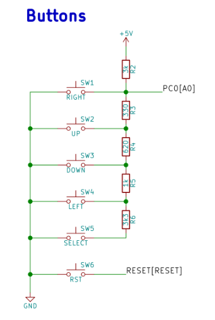

# Lab 7: ADC and UART serial communication

### Learning objectives

The purpose of the laboratory exercise is to understand analog-to-digital number conversion and the use of an internal 8-channel 10-bit AD converter. Another goal is to understand serial asynchronous communication, data frame structure and communication options using an internal USART unit.

## Preparation tasks (done before the lab at home)

Use schematic of the [LCD keypad shield](../../Docs/arduino_shield.pdf) and find out the connection of five push buttons: Select, Left, Up, Down, and Right.

According to the connection, calculate the voltage value on pin PC0[A0] if one button is pressed at a time. In this case, the voltage on the pin is given by the [voltage divider](https://www.allaboutcircuits.com/tools/voltage-divider-calculator/), where resistors R3, R4, R5 and R6 are applied successively.

&nbsp;

&nbsp;

&nbsp;

&nbsp;

What is the voltage value if none of the push buttons is pressed?

&nbsp;

Calculate the ADC values for these voltages according to the following equation if reference is Vref=5V and number of bits for analog to digital conversion is n=10.

   | **Push button** | **PC0[A0] voltage** | **ADC value (calculated)** | **ADC value (measured)** |
   | :-: | :-: | :-: | :-: |
   | Right  | 0&nbsp;V | 0   |  |
   | Up     | 0.495&nbsp;V | 101 |  |
   | Down   | 1.203&nbsp;V | 246 |  |
   | Left   | 1.969&nbsp;V | 403  |  |
   | Select | 3.181&nbsp;V | 651 |  |
   | none   | 5&nbsp;V |   1023  |  |
